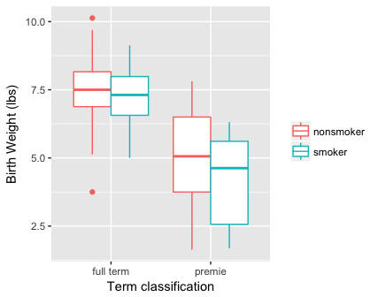
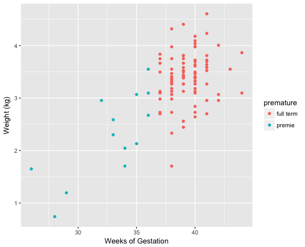

```{r setup, include=FALSE}
knitr::opts_chunk$set(echo = TRUE, prompt = FALSE, eval = FALSE, 
                      warning = TRUE, comment=NA, cache = FALSE,
                      fig.width = 6, fig.height = 4)
```


# Instructions

Create a R Markdown document and answer the questions below using code blocks that generate the correct outputs. I encourage you to use explanatory text in your markdown document, however **each of your solutions should show how to generate the answer using R code**. I encourage you to write "robust" solutions wherever possible. A good rule of thumb for judging whether your solution is appropriately "robust" is to ask yourself "If I added additional observations or variables to this data set, or if the order of variables changed, would my code still compute the right solution?"

Make sure your R Markdown is nicely formatted -- use headers, bullets, numbering, etc so that the structure of the document is clear.

Make sure to "knit" you document before submission to confirm that all code blocks and formatting is as you expect.

When completed, title your R Markdown file as follows:

- `netid-assignment_02-Spring2023.Rmd`

Submit both your Markdown file and the generated HTML document via the Assignments submission section on Sakai.


# Data set: NC Births data

This assignment uses the NC Births data set introduced in the worbook:

* https://github.com/Bio723-class/example-datasets/raw/master/nc-births.txt


# Problems

1. What are the dimensions of the births data set? [0.5 pt]

1.  Write a code block showing how to use `filter` to get all the cases where the age of both the mother and father was 20 years or younger [1 pt]
  
1. Write the equivalent code showing how to get the same cases using standard indexing [1 pt]

1. Write a code block that shows how to use `arrange` to sort the births data by the babies birth weight [1 pt]
  
1.  Using the output from the previous problem, in combination with standard indexing, show how to calculate the mean birth weight of the ten lightest babies [1 pt]
  
1. Show how to calculate the mean birth weight of the ten heaviest babies [1 pt]

1. Write a code block that uses `count()` to get the counts of cases by mother's smoking status and the baby's term status (premature or full term).  That is, we want the output to tell us four pieces of information [1 pt]
   * how many non-smoking mothers had full term babies
   * how many non-smoking mothers had premature babies
   * how many smoking mothers had full term babies
   * how many smoking mothers had premature babies. 

1. Create a boxplot figure like the one below to illustrate how birth weight varies conditional on term classification (premature or full term) and mother's smoking status [1 pts]
 
   ```{r, echo = FALSE, out.width = "400px", fig.align = "center", fig.cap = "Distribution Birth Weights as a Function of Term and Mother's Smoking", eval = TRUE, results = "show"}
  
```
 
1. Use `summarize()` to calculate the mean weights of babies for all four combinations of term classification and mother's smoking [1 pt]

1. Write a code block that uses pipes to count the number of premature births in the data set. [1 pt]

1. Write a code block that uses pipes to calculate the mean weight, in kilograms, of babies classified as premature. [1 pts]
  
1. Write a code block that uses pipes to create a scatter plot depicting birth weight in kilograms (y-axis) versus weeks of gestation (x-axis) for babies born to non-smoking mothers, coloring the points according to whether the baby was premature or full term. Your figure should look similar to the one below [2 pts]
  
   ```{r, echo = FALSE, out.width = "400px", fig.align = "center", fig.cap = "The relationship between birth weight and weeks of gestation for babies born to non-smoking mothers.", eval = TRUE, results = "show"}
  
   ```  
  
1. Consider this code:
   
   ```{r}
sample(5:10, 1) %>% sample_n(births, .)    
```

   - What does the function `sample` do? [0.5 pt]
   - What does the function `sample_n` do? [0.5 pt] 
   - What does the code block above do? [1 pt]
  
1. Consider the following  code block which illustrates two ways to calculate the mean and median gestation time for babies of mothers who smoke:

    ```{r}
    smokers.1 <-
      births %>%
      filter(smoke == "smoker") %>%
      summarize(mean.gestation = mean(weeks), median.gestation = median(weeks))
    
    smokers.2 <-
      births %>%
      filter(smoke == "smoker") %$%
      c(mean(weeks), median(weeks))
    ```

    - What is the type and class of `smokers.1`? [0.5 pt] 
    - What is the type and class of `smokers.2`? [0.5 pt]
    - Why does `smokers.1$mean.gestation` work, while `smokers.2$mean.gestation` raises an error? [1 pt]


  
  
