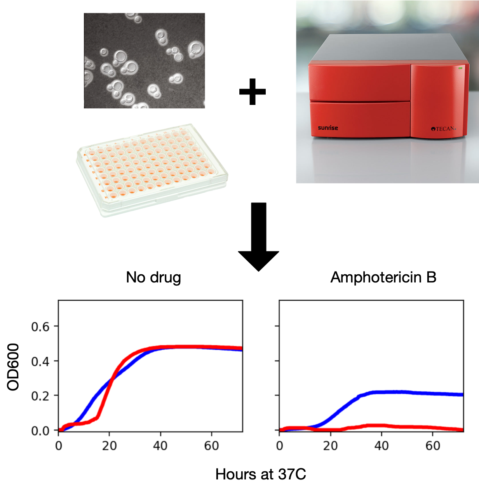
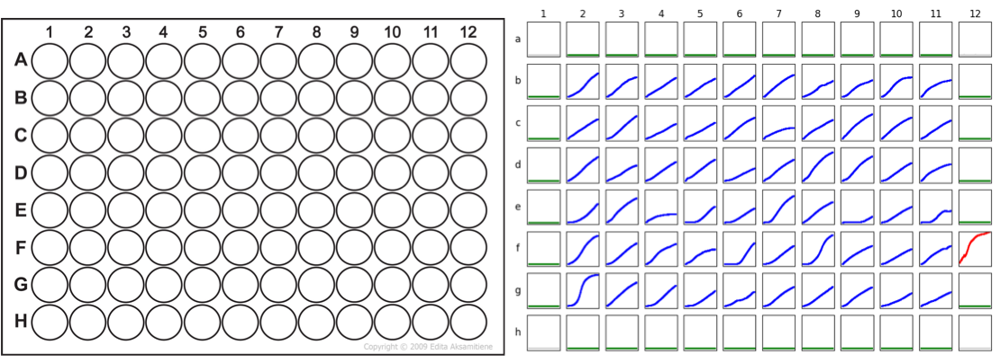

```{r setup, include=FALSE}
knitr::opts_chunk$set(echo = TRUE, 
                      warning=FALSE, 
                      message=FALSE, 
                      comment = "", 
                      collapse = TRUE)
options(width=70)
```

## Real-world data is often messy

Data files you generate or will be given may...

-   Be poorly organized
-   Have missing values
-   Contain extraneous information
-   Lack headers (variable names)
-   Confound variables and labels
-   Use different encoding schemes
-   Use unfamiliar conventions for dates, decimal separators, etc.
-   Include empty columns -- used for visual organization in spreadsheet, but interferes with analysis
-   Include meta data and comments

## Tidy data

To facilitate downstream analyses, data should be organized in a manner such that...

1.  Each variable must have its own column.
2.  Each observation must have its own row.
3.  Each value must have its own cell.


## `dplyr` and `tidyr` to the rescue

The tidyverse packages `dplyr` and `tidyr` provide many useful tools for wrangling data into a tidy form.

#### dplyr functions that facilitate wrangling

-   `select()`
-   `rename()`
-   `mutate()`
-   `recode()`
-   `slice()`

#### key functions introduced by tidyr

-   `pivot_longer()` - reshape column data into rows
-   `pivot_wider()` - reshape row data into columns
-   `separate()` - turns a single column into multiple columns
-   `unite()` - turns multiple columns in a single column

## Hands-on example: Wrangling microbial growth curves

{width=66%}

## Hands-on example: Plate layout, Final goal

{width=100%}
